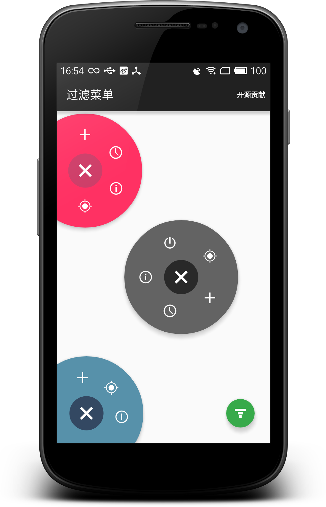

## FilterMenu

[](http://filtermenu.osslab.online/) [](http://developer.android.com/index.html) [](https://android-arsenal.com/api?level=14) [](http://osslab.online/)


一款非常高效的过滤器菜单视图，可自动检测并调整菜单布局，支持显示 Android 菜单资源文件。




## 使用方法

首先，你需要导入模块项目或者添加依赖类库：

```Gradle
dependencies {
    compile 'online.osslab:FilterMenu:1.0.0'
}
```


 - 布局文件
```xml
    <online.osslab.FilterMenuLayout
        android:id="@+id/filter_menu"
        android:layout_width="match_parent"
        android:layout_height="match_parent"
        android:elevation="8dp"
        app:expandedRadius="96dp"
        app:collapsedRadius="24dp"
        app:centerBottom="50dp"
        app:centerRight="50dp"
        app:primaryColor="#ff37aa4a"
        app:primaryDarkColor="#ff20622b">
    </online.osslab.FilterMenuLayout>
```

#####  `属性说明：`
```xml
    app:expandedRadius    // 扩展圆角
    app:collapsedRadius    //  初始圆角
    app:center[Left|Top|Right|Bottom]  // 显示位置（左上、左下、右上、右下）
    app:centerHorizontal    // 水平居中
    app:centerVertical    // 垂直居中
    app:primaryColor    // 初始主色调
    app:primaryDarkColor    // 扩展主色调
```

 - 代码构建
```java
FilterMenuLayout layout = (FilterMenuLayout) findViewById(R.id.filter_menu);
    FilterMenu menu = new FilterMenu.Builder(this)
        .addItem(R.drawable....)
        //.inflate(R.menu....)//inflate  menu resource
        .attach(layout)
        .withListener(new FilterMenu.OnMenuChangeListener() {
            @Override
            public void onMenuItemClick(View view, int position) {
            }
            @Override
            public void onMenuCollapse() {
            }
            @Override
            public void onMenuExpand() {
            }
        })
        .build();
```

## 关于作者

- [wall-e@live.cn](mailto:wall-e@live.cn)
- [开源软件实验室](http://osslab.online/)


## 许可协议

    Copyright 2015 linroid

    Licensed under the Apache License, Version 2.0 (the "License");
    you may not use this file except in compliance with the License.
    You may obtain a copy of the License at

       http://www.apache.org/licenses/LICENSE-2.0

    Unless required by applicable law or agreed to in writing, software
    distributed under the License is distributed on an "AS IS" BASIS,
    WITHOUT WARRANTIES OR CONDITIONS OF ANY KIND, either express or implied.
    See the License for the specific language governing permissions and
    limitations under the License.
